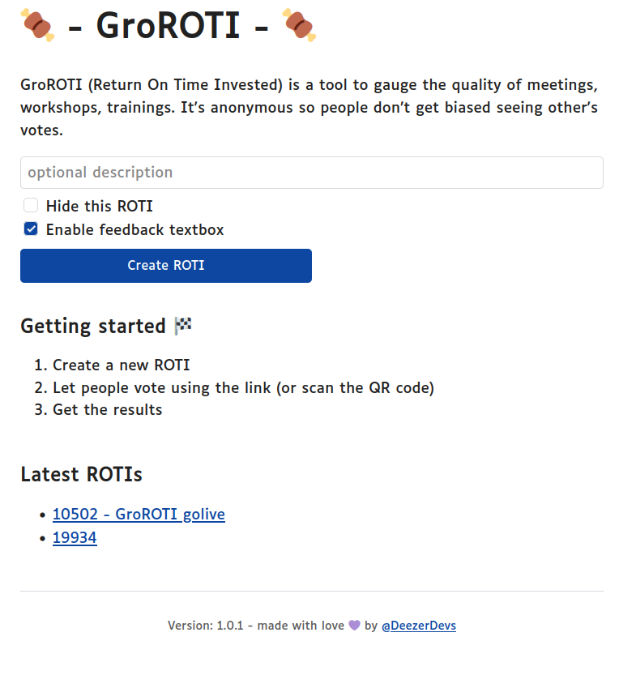

# GroROTI 🍖

Open source repository of G(r)oROTI 🍖, a selfhosted **Return On Time Invested** web application written in Go

The UI and functionalities are really basic. Here is a quick overview:
* create an anonymous ROTI in seconds
* find latest ROTIs in homepage (can be disabled with "Hide this ROTI" checkbox)
* Enable / disable textbox feedbacks in votes with a checkbox
* share the link (or QR code) with people that need to vote
* by default, ROTIs are cleaned 30 days after creation
* golang (memory, gc...), http (latency, codes...) and groroti metrics are exposed on `/-/metrics` path
* export ROTI results with a csv or a PNG file

|  |  |
| -------- | ------- |
|  |  |

## Run it!

### Locally with the binary

You can download the linux binary for arm64 and amd64 in the [releases page](https://github.com/deezer/GroROTI/releases). To build it yourself, see [building section](https://github.com/deezer/GroROTI?tab=readme-ov-file#build-it) of this page.

### With the docker image

Public docker images are available on [hub.docker.com](https://hub.docker.com/u/deezer).

You can pull/run the latest version by running:

```bash
docker pull deezer/groroti:latest
docker run -p 3000:3000 -e FRONTEND_URL=https://groroti.mydomain.tld deezer/groroti
```

Aside from frontend URL, to customize other parameters, see [Configuration section](https://github.com/deezer/GroROTI?tab=readme-ov-file#Configuration) on this page.

### Deploy with Kubernetes

You can deploy the helm chart in this repository with (change your values with your own):

```bash
cd helm
cp values-example.yaml values.yaml
helm install groroti -f values.yaml .
#or if already installed
helm upgrade groroti -f values.yaml .
```

### Deploy on Clever Cloud

Install clever-tools (`npm i -g clever-tools`), create an account on Clever cloud website. Then login in a terminal 

```bash
clever login
```

Create an app on clever cloud

```bash
clever create --type go groroti
```

Set SERVER_PORT to match clever cloud golang image (8080 instead of 3000)

```bash
clever env set SERVER_PORT 8080
```

Get URL (from clever cloud console) of the app and then change the FRONTEND_URL

```bash
clever env set FRONTEND_URL "https://app-xxx-xxx-xxx-xxx-xxx.cleverapps.io"
```

Or better yet, add a domain and put a DNS record on it

```bash
clever domain add groroti.mydomain.tld
clever env set FRONTEND_URL "https://groroti.mydomain.tld"
```

Tell clever cloud to use `gomod` method to install dependancies instead of `goget` (deprecated, will fail in this case)

```bash
clever env set CC_GO_BUILD_TOOL gomod
```

Deploy on clever cloud

```bash
clever deploy
```

## Configure it!

You can customize some of the features of GroROTI:

* **configuration file path** - default is "config.toml", can be overridden with *GROROTI_CONFIG* environment variable
* **server listening address** - default is "0.0.0.0", can be overridden with *SERVER_ADDR* environment variable or *server_addr* in configuration file
* **server listening port** - default is "3000", can be overridden with *SERVER_PORT* environment variable or *server_port* in configuration file
* **url for internal links** - default is "http://localhost:3000" but QR codes won't work (obviously). You can override this with *FRONTEND_URL* environment variable or *frontend_url* in configuration file
* **vote input step** - default is "0.5" but this can be customized (to allow only int for example) with *VOTE_STEP* environment variable or *vote_step* in configuration file
* **qr code size** - default is "384" (in pixels), can be overridden with *QR_CODE_SIZE* environment variable or *qr_code_size* in configuration file
* **clean over time** - when a new ROTI is created, remove all ROTIs that are older than xxx. Default is 30 (in days), can be overridden with *CLEAN_OVER_TIME* environment variable or *clean_over_time* in configuration file
* **enable tracing** - default is "false", can be overridden with *ENABLE_TRACING* environment variable or *enable_tracing* in configuration file
* **otlp endpoint** - default is "localhost:4318", can be overridden with *OTLP_ENDPOINT* environment variable or *otlp_endpoint* in configuration file

## Build it!

### Prerequisites

This software requires Go 1.22+

### Run dev version

The `Makefile` has an alias to help you run the server in dev mode with a simple `make dev` command

```console
make dev
SERVER_ADDR=127.0.0.1 SERVER_PORT=3000 FRONTEND_URL=http://localhost:3000 go run main.go
2022/05/09 22:41:56 Start listening on 127.0.0.1:3000
```

All building operations for the project (both binaries and docker images) are done using GoReleaser by default.

### goreleaser

You can build it on any commit using the `--snapshot` goreleaser option:

```bash
make snapshot
```

You can then test/run locally using the binary of the docker image:

```bash
#binary
dist/GroROTI_linux_amd64_v1/groroti

#docker image
docker run -p 3000:3000 docker.io/deezer/groroti:latest-amd64
```

### goreleaser for Deezer staff 

Deezer staff can push a new release by tagging the git repository to create a new release, and running `goreleaser`:

```bash
git tag -a 1.0.0 -m "1.0.0 release"
git push origin 1.0.0
export GITHUB_TOKEN="ghx_xxxxxxxxxxxxxxxxxx" #or use ~/.config/goreleaser/github_token file
goreleaser release
```

### manually

Should you decide to not use GoReleaser to build your binary / image, you should know that the Docker image requires the binary to be builded with `-extldflags '-static'` ldflags

```bash
go build -ldflags="-extldflags '-static'"
docker build -t localgroroti .
docker run -p 3000:3000 localgroroti
```

## Additionnal licences

fonts Luciole under Creative Commons Attribution 4.0 International Public License, © Laurent Bourcellier & Jonathan Perez. See [ReadMe.txt](internal/staticEmbed/static/ReadMe.txt) .
